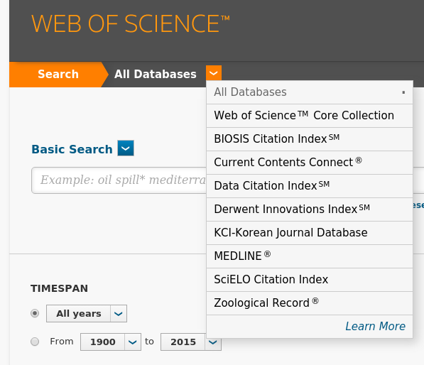
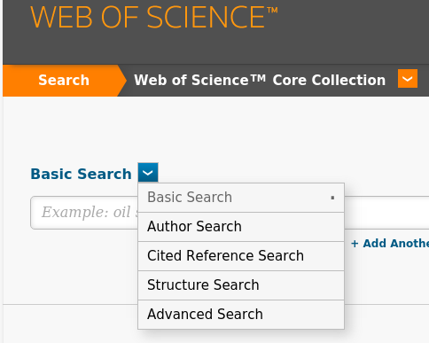
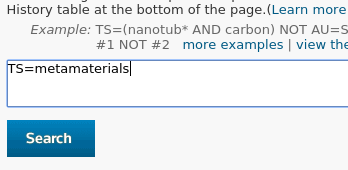
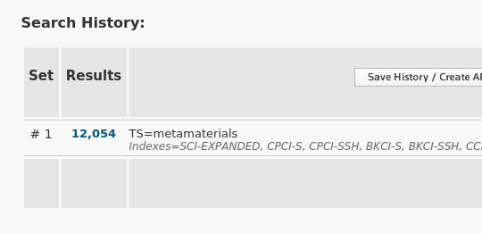
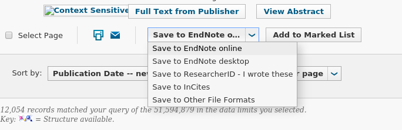
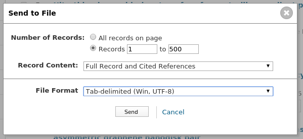
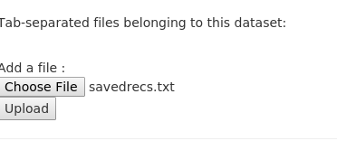
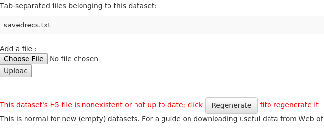

Adding Dataset Files
====================

Marion currently uses Web of Science queries dumped as tab-delimited files.
If that sounds like a mouthful, don't worry--it's easy to download them.

First, Choose Database
----------------------

Web of Science by default sets you up to query all their databases,
but we need to only use the "Web of Science Core Collection" database, so
click the down-arrow to select a database and choose it:

Next, choose Advanced Search
----------------------------

To get the most flexibility, we'll choose "advanced search" from the
available options:

Perform Your Search
-------------------

Next perfom your search; if we were going to search for articles tagged with
the topic of metamaterials, we would
type "TS=metamaterials" in the search box...

This would get us several thousand results:

Save Results to Disk
--------------------

Now for some fatigue; Web of Science only allows you to manually save results
to disk in blocks of 500 (as Marion has a difficult time doing large analyses
at the moment, this really constrains many queries to a few thousand results).

Go to your list of results by clicking on the "Results" link listing the number
of results; at the bottom of that list you will find a "Save to..." box; select
"Save to Other File Formats"

In this dialog, choose the records to save (for larger searches, you'll have to
do this in stages, ie "records 1 to 500" and then "records 501 to 1000", etc).

It's very important that for "Record Content" you choose "Full Record and Cited References",
and for "File Format" you choose "Tab-delimited (Win, UTF-8)".

Depending on your browser, this will save this block of references as "savedrecs.txt".
Continue to download as many blocks as you are going to use in Marion.

Add Records to your Marion Dataset
----------------------------------

Now you will have to add records to your Marion dataset.  From your "edit dataset" page,
under "Add a file", click "Choose File" to select a file, then "Upload" to add it to the
dataset.

After this, the file will now appear, but you will have to regenerate the "H5" file before
you can do any queries; click "Regenerate" to do this.

Now add Queries
---------------

Finally, your dataset is ready to query.  Add a few queries and examine the results!

